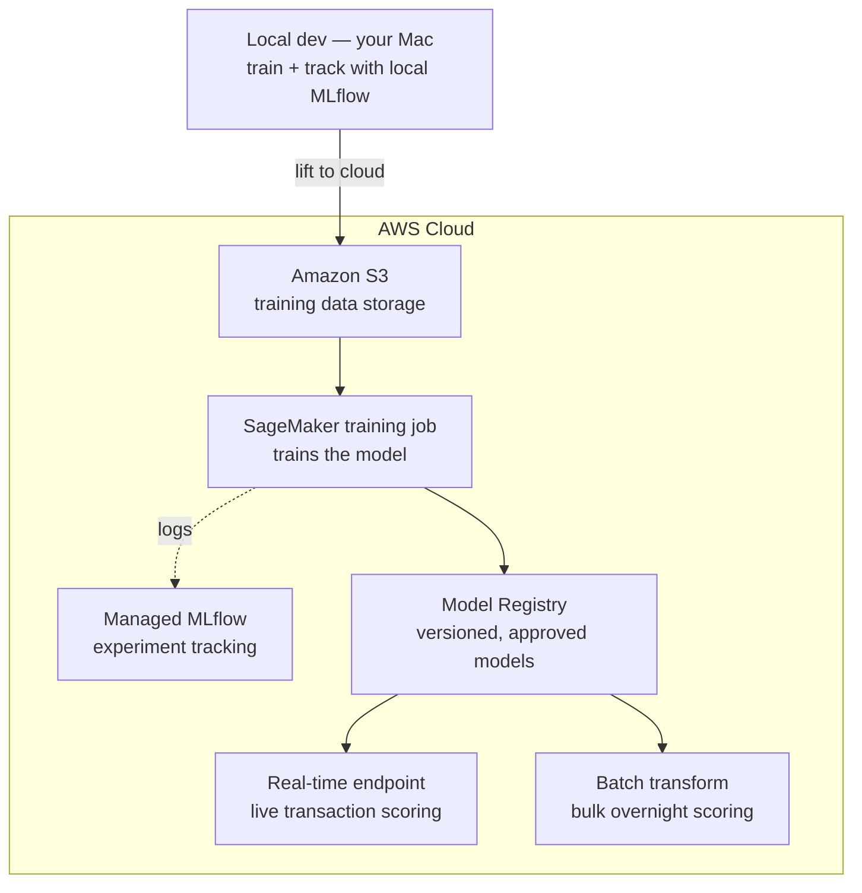
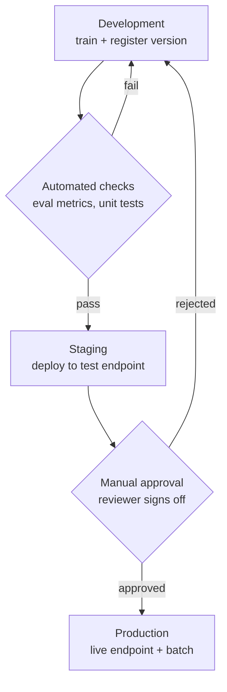

# Fraud Detection MLOps Pipeline


An end-to-end **MLOps** system that detects fraudulent credit-card transactions and serves predictions in both **real-time** and **batch** modes. The project takes a fraud-classification model through the complete production lifecycle — developed and trained locally (simulating an on-premises workflow), then migrated to **AWS SageMaker** for cloud-native training, experiment tracking with **MLflow**, model versioning through a model registry, and automated deployment.

---

## Why this project

Financial fraud is rare but expensive: fraudulent transactions make up well under 1% of all transactions, yet each missed one is costly. This makes fraud detection a classic **class-imbalance** problem, where raw accuracy is misleading and metrics like **precision, recall, and PR-AUC** are what actually matter.

Just as importantly, fraud detection needs *two* kinds of prediction, which is why it's an ideal MLOps project:

- **Real-time** — score a single transaction the instant it happens.
- **Batch** — re-scan an entire day's transactions overnight.

The same model is served both ways here.

---

## Architecture



**The flow:** the model is first trained locally (the "on-prem" stage). Once it works, data moves to **S3**, a **SageMaker training job** trains the model on managed compute while logging to **MLflow**, the result is versioned in the **Model Registry**, and the same model is deployed two ways — a persistent **real-time endpoint** and a scheduled **batch transform** job. Training is orchestrated as a repeatable **SageMaker Pipeline** and automated with **CI/CD**.

---

## Deployment strategy

Models are promoted through environments — **development → staging → production** — with an approval gate guarding each step, rather than being pushed straight to production. This is enforced through the model registry's approval status.



- **Development** — a freshly trained model is registered as a new version (status: pending).
- **Automated checks** — a machine gate: the model must clear minimum precision/recall thresholds and pass unit tests before advancing.
- **Staging** — the model is deployed to a real but non-customer-facing endpoint and tested with live-like traffic.
- **Manual approval** — a human gate: a reviewer explicitly signs off before the model reaches real customers (often required in regulated domains like fraud).
- **Production** — the approved version serves real transactions via the real-time endpoint and batch jobs.

Because every version is preserved in the registry, a failed gate sends the model back to development for a fix and a new version, and **rollback** is simply re-pointing production at the previous approved version.

---

## Tech stack

| Area | Tools |
|---|---|
| Language | Python 3.13 |
| ML | scikit-learn, XGBoost, pandas, NumPy |
| Experiment tracking | MLflow (local + AWS-managed) |
| Cloud / MLOps | AWS SageMaker (Training Jobs, Model Registry, Endpoints, Batch Transform, Pipelines), Amazon S3 |
| Packaging | Docker |
| CI/CD | GitHub Actions |

---

## Dataset

[Credit Card Fraud Detection](https://www.kaggle.com/datasets/mlg-ulb/creditcardfraud) — anonymized transactions labeled as fraudulent or genuine. Highly imbalanced (~0.17% fraud), which drives the evaluation strategy.

> **Note:** the dataset is not committed to this repo (it's large and gitignored). See setup below to download it.

---

## Project structure

```
fraud-detection-mlops/
├── data/                   # raw + processed data (gitignored)
├── notebooks/              # exploratory data analysis
├── src/
│   ├── data/               # data preparation scripts
│   ├── train/              # model training scripts
│   ├── deploy/             # real-time endpoint + batch transform
│   └── pipeline/           # SageMaker Pipeline definition
├── tests/                  # unit tests
├── .github/workflows/      # CI/CD automation
├── requirements.txt
├── .gitignore
└── README.md
```

---

## Roadmap

- [ ] **Phase 0** — Local environment setup (Python, Docker, AWS CLI)
- [ ] **Phase 1** — Exploratory data analysis on the fraud dataset
- [ ] **Phase 2** — Train a baseline model locally
- [ ] **Phase 3** — Track experiments with local MLflow
- [ ] **Phase 4** — Migrate to AWS: S3 + managed MLflow + SageMaker training job
- [ ] **Phase 5** — Register the model in the SageMaker Model Registry
- [ ] **Phase 6** — Deploy a real-time inference endpoint
- [ ] **Phase 7** — Run batch transform for bulk scoring
- [ ] **Phase 8** — Orchestrate the workflow as a SageMaker Pipeline
- [ ] **Phase 9** — Add CI/CD (GitHub Actions) and model monitoring

---

## Getting started

### Prerequisites
- macOS (Apple Silicon or Intel)
- Python 3.12+
- An AWS account (needed from Phase 4 onward)

### Setup

```bash
# clone the repo
git clone https://github.com/<your-username>/fraud-detection-mlops.git
cd fraud-detection-mlops

# create and activate a virtual environment
python3 -m venv .venv
source .venv/bin/activate

# install dependencies
pip install -r requirements.txt
```

Then download the dataset from Kaggle and place `creditcard.csv` in the `data/` folder.

---

## Results

_To be added once the model is trained. Will report precision, recall, PR-AUC, and a confusion matrix — the metrics that matter for imbalanced fraud detection._

| Metric | Score |
|---|---|
| Precision | _TBD_ |
| Recall | _TBD_ |
| PR-AUC | _TBD_ |

---

## What I learned

_To be filled in as the project progresses — a short reflection on the MLOps concepts applied (experiment tracking, model registry, real-time vs. batch inference, orchestration, CI/CD)._

---

## License

MIT
